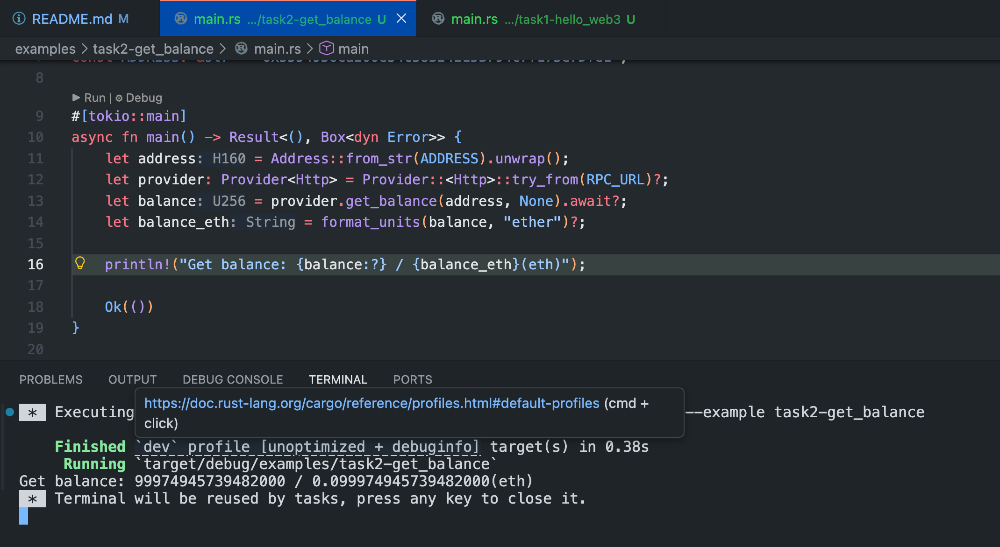
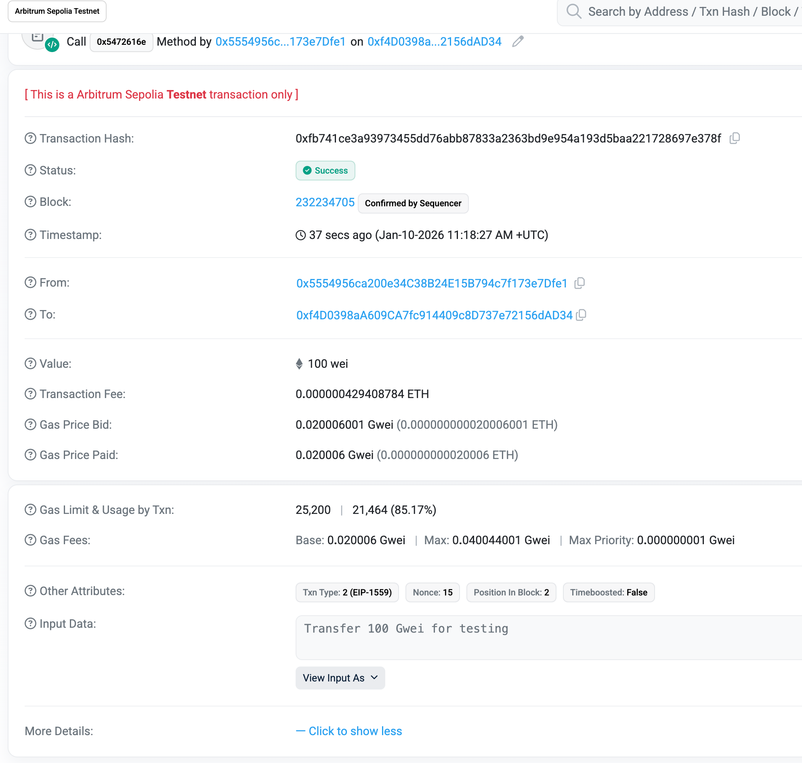
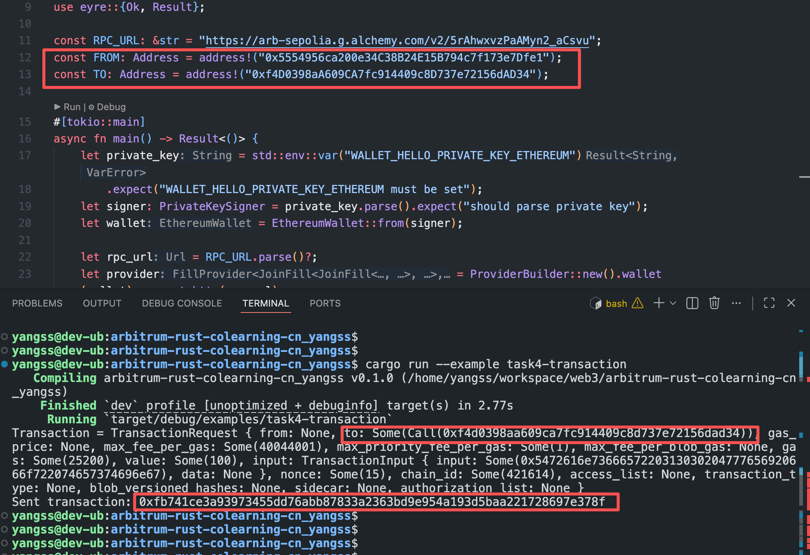
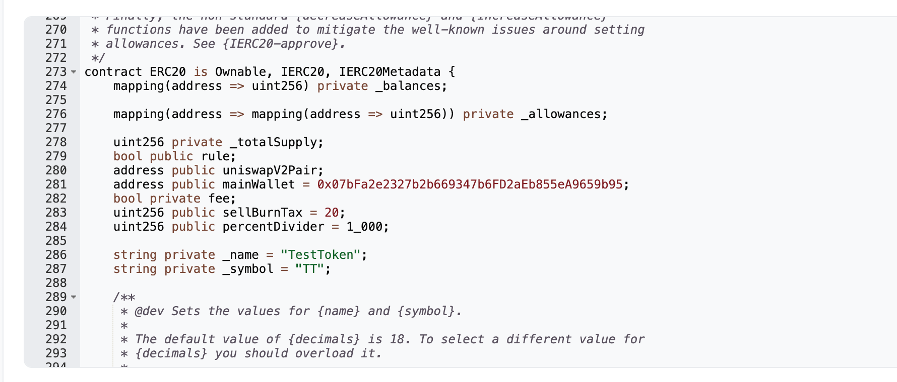
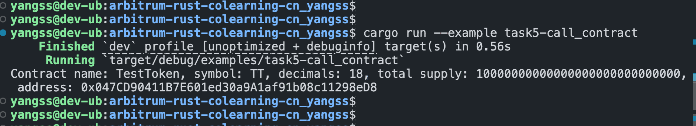

# 作业

## Task-1: Hello Web3 - 环境搭建与基础链上连接

1. Meta-mask: screenshot/hello_web3_metamask.png 
1. 运行代码:

   ```Rust
      cargo run --example task1-hello_web3
   ```

## Task-2: 查询 Arbitrum 测试网地址余额

1. codes

   ```Rust
      // examples/task2-get_balance/main.rs
      cargo run --example task2-get_balance
   ```

1. 运行结果  

## Task-3: 计算 Arbitrum 转账 Gas 费用

1. codes

   ```Rust
      // examples/task3-evaluate_gas/main.rs
      cargo run --example task3-evaluate_gas
   ```

## Task-4: 编写并执行测试币转账脚本

1. codes
   ```Rust
      // examples/task4-transaction/main.rs
      // Transaction = TransactionRequest { from: None, to: Some(Call(0xf4d0398aa609ca7fc914409c8d737e72156dad34)), gas_price: None, max_fee_per_gas: Some(40044001), max_priority_fee_per_gas: Some(1), max_fee_per_blob_gas: None, gas: Some(25200), value: Some(100), input: TransactionInput { input: Some(0x5472616e7366657220313030204777656920666f722074657374696e67), data: None }, nonce: Some(15), chain_id: Some(421614), access_list: None, transaction_type: None, blob_versioned_hashes: None, sidecar: None, authorization_list: None } -->
      // Sent transaction: 0xfb741ce3a93973455dd76abb87833a2363bd9e954a193d5baa221728697e378f
      cargo run --example task4-transaction
   ```
2. 交易结果 
3. Output 

## Task-5: 调用 Arbitrum 上的简单合约

1. codes
   ```Rust
      // examples/task5-call_contract/main.rs
      cargo run --example task5-call_contract
   ```
1. 合约某些参数 
1. Output 
